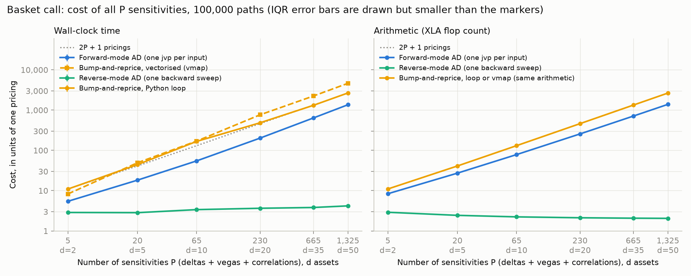

# Monte Carlo Greeks by Algorithmic Differentiation

This project computes Monte Carlo option Greeks in JAX by algorithmic differentiation
(AD). It compares them with finite differences, likelihood-ratio and mixed estimators
and payoff smoothing, using paired-bootstrap confidence intervals. Reverse-mode AD
delivers all 1,325 sensitivities (+ price) of a 50-asset arithmetic basket for 4.2x the
time of one pricing (2.05x in flops), against about 2,700x for bump-and-reprice.
Those Greeks are validated through the geometric basket: it has a closed form and
shares all the simulation and Cholesky code, and its 1,325 sensitivities (+ price) are
unbiased with calibrated standard errors (E9). AD is not uniformly best, though: tuned
common-random-number bumping is 2% more accurate for delta, autodiff gamma and
digital delta are identically zero without a fix, and which fix wins depends on
moneyness.



*E6. Cost of all P = d + d + d(d-1)/2 sensitivities (+ price) of a d-asset basket call,
in units of one pricing (100,000 paths, CPU). Reverse mode stays flat at 2.8-4.2x in
time and 2-3x in flops; forward mode and bumping grow linearly in P. Left: wall-clock
time. Right: XLA flop count. "One pricing" excludes random-number generation: the
normals are an input. End to end, with the normals generated inside the pipeline, AD
costs ~1.5x one pricing (E7).*

## Quickstart

```bash
git clone https://github.com/Coderyash05/mc-aad-greeks && cd mc-aad-greeks
python -m venv .venv
source .venv/bin/activate          # Windows PowerShell: .venv\Scripts\Activate.ps1
pip install -e ".[dev]"            # jax, numpy, scipy, matplotlib, pytest
pytest -q                          # 216 tests, ~25 s; prints the false-alarm budget
```

```python
import jax, jax.numpy as jnp
import mcgreeks                                   # enables float64
from mcgreeks.basket import basket_greeks
from mcgreeks.black_scholes import bs_greeks
from mcgreeks.greeks_ad import ad_greeks_se
from mcgreeks.greeks_lr import mean_se, pwlr_gamma_parity_samples
from mcgreeks.models import normals

Z = normals(jax.random.PRNGKey(0), 1_000_000)
S0, sigma, r, T, K = 100.0, 0.2, 0.05, 1.0, 100.0
bs = bs_greeks(S0, K, r, sigma, T)

est = ad_greeks_se(S0, sigma, r, T, K, Z)         # pathwise delta, vega, rho with SEs, one reverse pass
for g in ("delta", "vega", "rho"):
    m, se = est[g]
    print(f"{g:<6} {float(m):9.4f} ± {float(se):.4f} (1 SE)   Black-Scholes {float(bs[g]):.4f}")

m, se = mean_se(pwlr_gamma_parity_samples(S0, sigma, r, T, K, Z))   # autodiff gamma would be 0
print(f"gamma  {float(m):9.5f} ± {float(se):.5f} (1 SE)  Black-Scholes {float(bs['gamma']):.5f}")

d = 20                                            # 20 deltas + 20 vegas + 190 correlation sensitivities
Zb = jax.random.normal(jax.random.PRNGKey(1), (100_000, d), dtype=jnp.float64)
g = basket_greeks(jnp.full(d, 100.0), jnp.linspace(0.15, 0.35, d),
                  jnp.full(d * (d - 1) // 2, 0.5), r, T, K, jnp.full(d, 1.0 / d), Zb)
n = g["delta"].size + g["vega"].size + g["corr"].size
print(f"basket price {float(g['price']):.4f} and {n} sensitivities from one reverse pass")
```

Output (± is 1 standard error here; the Results table below uses 95% CIs):

```text
delta     0.6369 ± 0.0006 (1 SE)   Black-Scholes 0.6368
vega     37.5204 ± 0.0756 (1 SE)   Black-Scholes 37.5240
rho      53.2364 ± 0.0472 (1 SE)   Black-Scholes 53.2325
gamma    0.01877 ± 0.00002 (1 SE)  Black-Scholes 0.01876
basket price 9.7829 and 230 sensitivities from one reverse pass
```

## Results

Brackets are 95% confidence intervals unless marked IQR. Ratios compare methods
on the same random numbers (paired bootstrap). "A beats B" is claimed only when the
ratio's CI excludes 1. Full tables, figures and caveats are in
[docs/EXPERIMENTS.md](docs/EXPERIMENTS.md).

| Question | Result | Where |
|---|---|---|
| Cost of all 1,325 sensitivities (+ price), 50-asset basket | Reverse AD **4.2x** one pricing [IQR 4.0, 4.3], 2.05x in flops. Forward AD 1,359x; bumping 2,666x (loop) and 4,629x (vectorised) | E6 |
| When does forward mode win? | 1,000 outputs, 1 input: forward **43x** [IQR 43, 44] vs reverse 17,261x | E6b |
| Delta accuracy: AD vs tuned CRN bumping (ATM) | RMSE ratio FD / AD = **0.978 [0.962, 0.994]**: bumping 2% better. Negative result for AD; it needs a tuned h | E2 |
| Gamma, ATM: which estimator? | Pathwise-LR (parity) best, RMSE 0.00017 [0.00016, 0.00018]. Plain pathwise-LR 1.58x [1.45, 1.71], CRN FD 1.76x [1.61, 1.92], smoothed AD 1.97x [1.81, 2.15], LR (parity) 3.50x [3.26, 3.76], LR 5.63x [5.15, 6.16]. Naive AD returns exactly 0 | E3 |
| Digital delta, ATM | LR best. CRN FD 1.65x [1.52, 1.79], smoothed AD 1.70x [1.57, 1.84]; those two not distinguishable (1.03x [0.99, 1.07]) | E5 |
| Do the ATM winners generalise (20 strikes x maturities)? | No. In the money plain pathwise-LR is up to **28x** and LR **23x** worse than the best method | E8 |
| Fix for the in-the-money failure | Parity switch (put leg when K < forward). Pathwise-LR (parity) / plain = **0.045 [0.038, 0.053]** at K = 80, T = 0.1; best or tied in 17/20 gamma cells, worst 2.9x. LR (parity) for digital delta: 15/20, worst 1.7x | E8 |
| Most robust gamma estimator | Smoothed AD: never worse than 2.4x the best in any cell, but best or tied in only 6/20 | E8 |
| Are the basket Greeks right? 1,325 sensitivities (+ price), d = 50, geometric closed form | Over 200 seeds, mean z² = **1.03 [1.00, 1.06]** (t₁₉₉: 1.01), mean z = -0.00 [-0.02, +0.02]. No detectable bias; calibrated SEs | E9 |
| Adjoint memory for 1e6 paths (d = 50) | 2,024 MB one-shot to **20 MB** chunked (B = 1e4), at 1.03x the time and identical flops | E7 |
| Adjoint memory for 1,000 time steps (Asian) | 172 MB to **11 MB** with √M checkpointing, for 2x the flops | E7 |
| End-to-end AD overhead including random numbers | ~1.5x one pricing (basket 1.47x). RNG is 58-98% of pricing flops and is never differentiated | E7 |

## Relation to the literature

- **Giles & Glasserman (2006).** The adjoint computes exactly the pathwise estimator;
  its advantage is cost only.
  - E6 reproduces the shape of their Fig. 4: adjoint cost flat in the number of
    inputs, forward cost linear.
  - E6b shows the reverse situation (many outputs, one input), where forward mode wins.
  - Their §6 point that pathwise gamma needs a smoothed payoff appears here as naive AD
    gamma ≡ 0 (E3).
- **Capriotti (2011).** CRN bumping with vanishing h is the pathwise estimator
  (eq. 2.8). Here it is a tested path-wise bound, and at a finite, tuned h bumping is
  slightly *more* accurate (E2).
  - His measured adjoint cost is ~2.3x for basket deltas and vegas and ~2.8x for Asians
    (Fig. 9). Ours is 2.05x (basket, d = 50) and 2.25x (Asian) in flops excluding the
    random numbers.
  - In wall-clock ours is 2.8-4.2x: reverse mode here is limited by memory traffic
    (bytes accessed 3.8x one pricing), not arithmetic.
  - His §4.3 handles discontinuous payoffs by smoothing at a small bias. E5 and E8
    confirm smoothing works, but at the money it loses to LR, and its bias is O(eps²)
    (tested).
- **Broadie & Glasserman (1996); Glasserman (2004, ch. 7).** Pathwise estimators need
  a Lipschitz payoff (Glasserman pp. 393-395). LR needs only the density but has
  higher variance; mixed pathwise-LR combines the two.
  - E3/E5/E8 quantify the variance trade-off across moneyness and maturity.
  - The parity switch is the control-variate idea of Glasserman (2004, ch. 4) applied
    inside the LR estimator.
  - Standard errors, batch means and CIs follow Glasserman (2004, App. A).
- **Griewank & Walther (2008).** The cheap-gradient bound (reverse mode ≤ a small
  constant times the function) and binomial/√M checkpointing (ch. 12). E7 measures
  both.
- **What is new here** is not a method but the measurement. Every comparison uses
  paired batches with bootstrap CIs and out-of-sample tuning. There is a 20-cell
  robustness sweep, a closed-form check of all 1,325 correlation-inclusive geometric
  basket sensitivities (+ price), and an explicit family-wise false-alarm budget for the
  test suite
  ([docs/TESTING.md](docs/TESTING.md)).

## Limitations

- **GBM only.** The likelihood-ratio, pathwise-LR and parity fixes are shown for
  geometric Brownian motion only. Their weights use the lognormal transition density.
  Under stochastic or local volatility (e.g. Heston), the LR weight needs the
  transition density of the discretised path, or Malliavin weights. That is not
  implemented or tested; the Heston extension was skipped.
- **Payoffs:** European calls, puts and digitals, arithmetic and geometric Asians,
  arithmetic and geometric baskets. There are no barriers, no early exercise
  (American/Bermudan, regression methods) and no path-dependent smoothing beyond
  these.
- **Hardware:** all timings are on one CPU (Intel i7-13700HX, JAX 0.11.2 CPU backend).
  Wall-clock varies 20-25% between runs and can be bimodal (performance vs efficiency
  cores). Flop counts are the primary, machine-independent metric. Nothing was run on
  a GPU, where the memory-bound conclusions may differ.
- **Tuned parameters:** bump sizes h and smoothing widths eps are tuned per case on
  separate calibration batches. A practitioner without a reference value has to choose
  them some other way, and E8 shows the choice matters.
- **Bumping baseline:** bumping reprices from scratch (generic black-box bumping). A
  hand-optimised bump that reuses shared work would be faster.
- **Rare events:** deep out-of-the-money cases (fewer than 100 paying paths) get no
  importance sampling. The tests check structural facts there instead of an SE.
- **One volatility and rate in the sweep:** E8 varies strike and maturity only, at
  σ = 0.2 and r = 0.05. Which estimator wins may shift at other volatilities, and the
  parity switch point S0 e^{rT} moves with r.
- **Unexplained artefacts:** AD-overhead ratios below 1 in two chunked configurations
  come from how XLA compiles the price-only program. They are reported, not
  investigated.
- **Test false alarms:** with every seed redrawn, the suite would fail by chance with
  probability ≤ 2.0%. Seeds are fixed, so a failure means the numbers changed
  ([docs/TESTING.md](docs/TESTING.md)).

## Reproducibility

- **Determinism.** float64 throughout (`import mcgreeks`). Every random stream is
  `jax.random.PRNGKey(zlib.crc32(tag))` with a fixed, readable tag (never Python's
  `hash()`), and batches are split with `fold_in`. Re-running any accuracy experiment
  reproduces its CSV exactly, apart from rounding at ~1e-11.
- **Timings** are hardware-dependent. They are medians and IQRs over repeated runs
  after compilation, with the hardware recorded in `results/*_hardware.json`
  (protocol in [docs/EXPERIMENTS.md](docs/EXPERIMENTS.md#timing-protocol)). Figures
  of the timing experiments redraw from their CSVs with `--plot-only`, without
  re-timing.
- **Every number in this README** comes from a CSV in `results/`, written by:

| Experiment | Command | Outputs (`results/`) |
|---|---|---|
| E1 pricer, 3 Greeks, timing | `python experiments/e1_greeks.py` | `e1_timing.csv`, `e1_hardware.json` |
| E2 finite differences vs AD | `python experiments/e2_fd_vs_ad.py` (~20 s) | `e2_headline.csv`, `e2_fd_vs_ad.csv`, `.png` |
| E3 + E4 gamma | `python experiments/e3_gamma.py` | `e3_gamma.csv`, `e3_pairwise.csv`, `e3_tuning.csv`, `e4_smoothing.csv` |
| E5 digital delta | `python experiments/e5_digital.py` | `e5_summary.csv`, `e5_pairwise.csv`, `e5_tuning.csv` |
| E6 basket cost (timed) | `python experiments/e6_basket.py [--plot-only]`; `e6_chunk_sweep.py` | `e6_basket.csv`, `e6_chunk_sweep.csv`, `e6_roofline.csv` |
| E6b forward-mode regime (timed) | `python experiments/e6b_forward_regime.py [--plot-only]` | `e6b_forward_regime.csv` |
| E7 memory and end-to-end cost | `python experiments/e7_memory.py [--plot-only]`; `e7_wallclock.py` | `e7_memory.csv`, `e7_wallclock*.csv` |
| E8 robustness sweep | `python experiments/e8_sweep.py [--plot-only]` (~1.5 min) | `e8_sweep.csv`, `e8_summary.csv`, `e8_parity.csv` |
| E9 basket accuracy | `python experiments/e9_geometric_basket.py` (~1 min) | `e9_geometric_basket.csv`, `e9_calibration.csv`, `e9_aggregate.csv` |

## Repository layout

| Path | Contents |
|---|---|
| `src/mcgreeks/` | `pricer`, `models` (GBM), `black_scholes`, `greeks_ad` (forward/reverse), `greeks_fd`, `greeks_lr` (LR, pathwise-LR, parity, smoothing), `basket`, `asian`, `chunked` (chunked adjoint, √M checkpointing), `stats` (paired bootstrap, tuning, family tests), `bench` |
| `experiments/` | E1-E9 scripts |
| `tests/` | 216 tests; `helpers.py` holds the statistical assertions |
| `docs/EXPERIMENTS.md` | every experiment in full |
| `docs/DERIVATIONS.md` | the maths behind each estimator, plus 10 interview questions |
| `docs/TESTING.md` | how statistical tests are built and their false-alarm budget |
| `CHANGELOG.md` | how results moved between versions of the code (before/after comparisons) |

## References

- Box, G. E. P. (1954). Some theorems on quadratic forms applied in the study of analysis of variance problems. *Annals of Mathematical Statistics* 25(2), 290-302.
- Broadie, M. & Glasserman, P. (1996). Estimating security price derivatives using simulation. *Management Science* 42(2), 269-285.
- Capriotti, L. (2011). Fast Greeks by algorithmic differentiation. *Journal of Computational Finance* 14(3), 3-35.
- Efron, B. & Tibshirani, R. J. (1993). *An Introduction to the Bootstrap*. Chapman & Hall.
- Giles, M. & Glasserman, P. (2006). Smoking adjoints: fast Monte Carlo Greeks. *Risk*, January 2006.
- Glasserman, P. (2004). *Monte Carlo Methods in Financial Engineering*. Springer.
- Griewank, A. & Walther, A. (2008). *Evaluating Derivatives: Principles and Techniques of Algorithmic Differentiation*, 2nd ed. SIAM.
- Isserlis, L. (1918). On a formula for the product-moment coefficient of any order of a normal frequency distribution in any number of variables. *Biometrika* 12(1/2), 134-139.
- Kemna, A. G. Z. & Vorst, A. C. F. (1990). A pricing method for options based on average asset values. *Journal of Banking & Finance* 14(1), 113-129.
- Satterthwaite, F. E. (1946). An approximate distribution of estimates of variance components. *Biometrics Bulletin* 2(6), 110-114.
- Šidák, Z. (1967). Rectangular confidence regions for the means of multivariate normal distributions. *Journal of the American Statistical Association* 62(318), 626-633.
