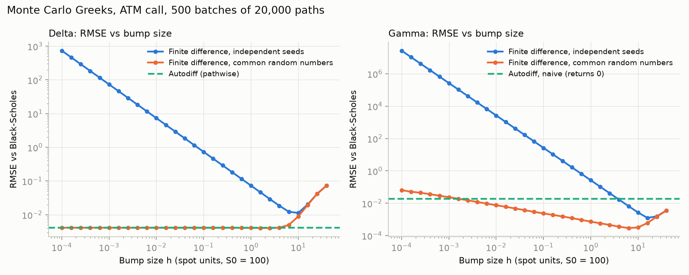
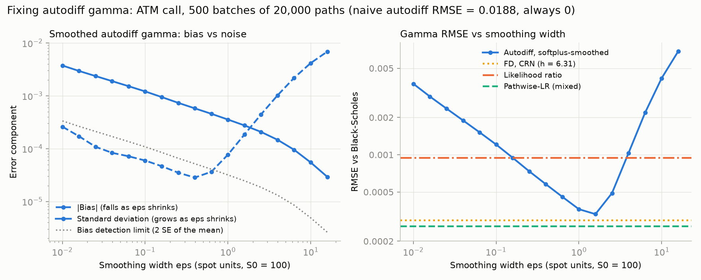
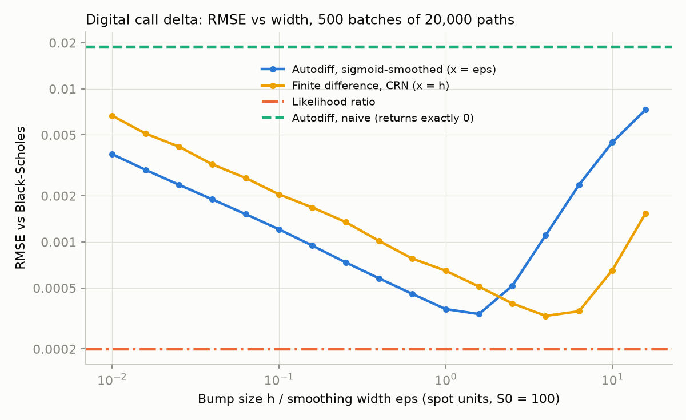

# Monte Carlo Greeks by Algorithmic Differentiation

Monte Carlo option pricing in JAX, with Greeks computed by automatic differentiation
and compared against finite differences, likelihood-ratio estimators and Black-Scholes.

## Status

- [x] European call/put pricer (GBM, vectorised, jit-compiled), validated against Black-Scholes (E1)
- [x] Autodiff delta, vega, rho with standard errors, validated against Black-Scholes
- [x] Finite-difference baseline (CRN and independent seeds), error vs bump size (E2)
- [x] Gamma: naive AD vs LR vs pathwise-LR vs smoothing (E3, E4)
- [x] Digital options: autodiff delta fails, LR / smoothing / FD compared (E5)
- [ ] Basket option and cost scaling

## Setup

```bash
python -m venv .venv
source .venv/bin/activate          # Windows: .venv\Scripts\activate
pip install -e ".[dev]"
pytest
python experiments/e1_validation.py
```

## E1: pricer validation

54 cases (call/put, K in {80, 100, 120}, T in {0.25, 1, 2}, sigma in {0.1, 0.2, 0.4}),
S0 = 100, r = 5%, 1,000,000 paths each, independent seeds per case.
Result: all 54 within 3 standard errors of Black-Scholes. Full table in `results/e1_prices.csv`.

## E1: autodiff Greeks

Delta, vega and rho from one `jax.value_and_grad` call (pathwise estimator), with
standard errors from per-path gradients (`jax.vmap`). Same 54-case grid, 1,000,000 paths,
independent seeds. Every Greek within 3 SE of Black-Scholes; mean z between -0.26 and +0.04.
Cases where the per-path estimator is constant (every path in or out of the money,
e.g. deep ITM call rho = K T e^{-rT}) have zero variance and are reported separately.
Full table: `results/e1_greeks.csv`.

Cost with 3 Greeks (Windows, 24-thread CPU, N = 1,000,000): autodiff 7.9x one pricing,
central-difference bumping 7.4x. With three parameters the two cost about the same;
reverse mode's advantage is that its cost does not grow with the number of parameters
(see the basket experiment). Timings are machine-dependent.

## E2: finite differences vs autodiff



ATM call, 500 independent batches of 20,000 paths, RMSE against Black-Scholes.

| Estimator | Best h | RMSE |
|---|---|---|
| Delta, FD independent seeds | 10 | 0.0113 |
| Delta, FD common random numbers | 2.5 | 0.0040 |
| Delta, autodiff (pathwise) | none | 0.0041 |
| Gamma, FD independent seeds | 16 | 0.0013 |
| Gamma, FD common random numbers | 6.3 | 0.0003 |
| Gamma, autodiff (naive) | none | 0.0188 (returns exactly 0) |

- Independent seeds: error grows like 1/h (delta) and 1/h^2 (gamma) as h shrinks,
  because noise that does not cancel is divided by the bump. The optimum is a large,
  biased bump, and the error there is ~3x worse than autodiff.
- CRN: delta converges to the pathwise (autodiff) estimator as h -> 0, with the same
  error. It needs a tuned h and two repricings per parameter; autodiff needs neither.
- Gamma with CRN grows like h^(-1/2) as h shrinks: only paths within h of the strike
  contribute, each with a 1/h-sized term.
- Naive autodiff gamma is exactly 0 on every batch (the payoff's second derivative is
  zero almost everywhere). Fixed in the next step.

## E3 + E4: fixing autodiff gamma



Same 500 x 20,000 random numbers as E2. Exact gamma 0.01876.

| Estimator | Bias | Std | RMSE |
|---|---|---|---|
| Autodiff, naive | -1.9e-02 | 0 | 0.01876 |
| FD, CRN (h = 6.31) | -9.8e-05 | 0.00028 | 0.00029 |
| Likelihood ratio | 2.1e-05 | 0.00095 | 0.00094 |
| **Pathwise-LR (mixed)** | 1.4e-05 | 0.00026 | **0.00026** |
| Autodiff, softplus-smoothed (eps = 1.6) | -1.9e-04 | 0.00027 | 0.00033 |

- Naive autodiff returns exactly 0: the payoff's second derivative is a Dirac delta
  at the strike, which differentiating the code cannot see.
- Likelihood ratio is unbiased for any payoff but has ~3.6x the noise of the others.
- Pathwise-LR (pathwise delta, then one LR step) is unbiased and has the lowest RMSE,
  beating the best-tuned finite difference.
- Smoothing lets plain autodiff work, with the same bias-variance trade-off as a bump
  size: bias grows with eps, noise grows as eps shrinks, optimum eps ~ 1.6. Its best
  RMSE is close to, but not better than, FD with CRN.
- For small eps the measured bias is below the detection limit of 500 batches
  (dotted line); those points are noise, not a real bias.

## E5: digital options (autodiff delta fails)



Cash-or-nothing call paying 1 if S_T > K, ATM. Exact delta 0.01876. Same random numbers as E2-E4.

| Estimator | Bias | Std | RMSE |
|---|---|---|---|
| Autodiff, naive (pathwise) | -1.9e-02 | 0 | 0.01876 |
| FD, CRN (best h = 4) | -1.1e-04 | 0.00031 | 0.00033 |
| Autodiff, sigmoid-smoothed (best eps = 1.6) | -2.0e-04 | 0.00027 | 0.00034 |
| **Likelihood ratio** | 1.2e-05 | 0.00020 | **0.00020** |

- The payoff jumps at the strike and is flat elsewhere, so every path's derivative is 0:
  autodiff returns exactly 0 even for a first-order Greek.
- The likelihood ratio needs no smoothness and no tuning, and wins outright here.
- Smoothing and FD have the same U-shaped trade-off and reach similar best errors.
- At K = S0 the digital delta equals the vanilla call gamma (both 0.01876), since
  S0 phi(d1) = K e^{-rT} phi(d2) when K = S0. The two problems are the same
  maths: differentiating through a jump at the strike. That is why E3 and E5
  produce nearly identical numbers.
