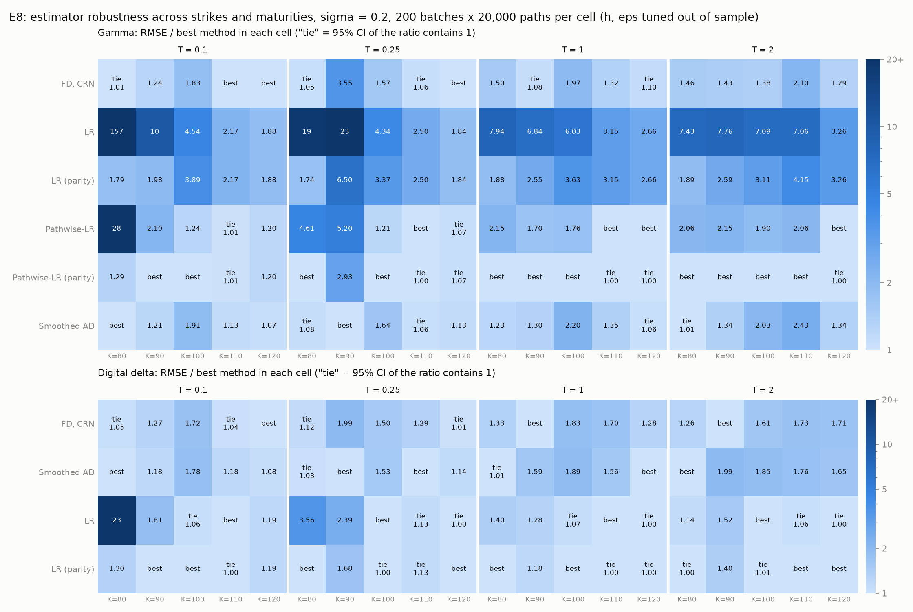
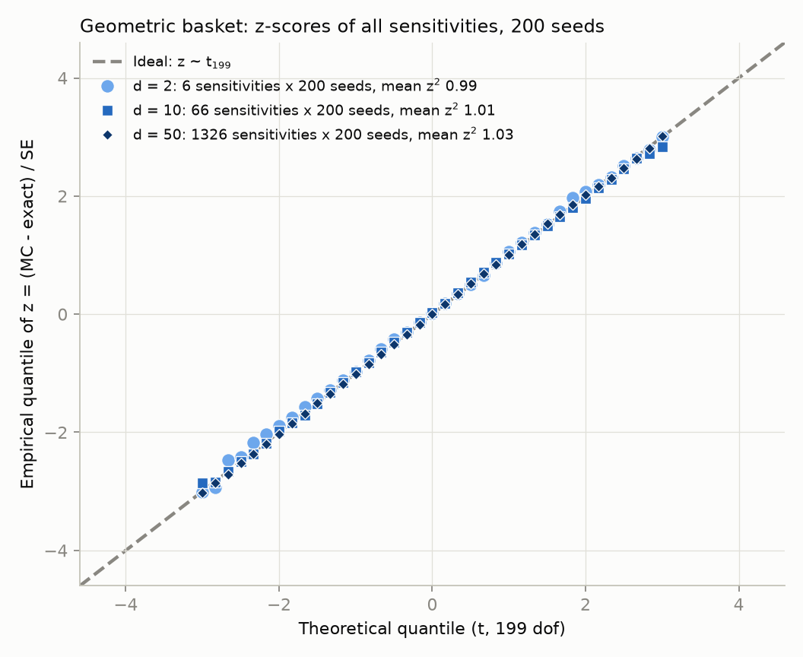
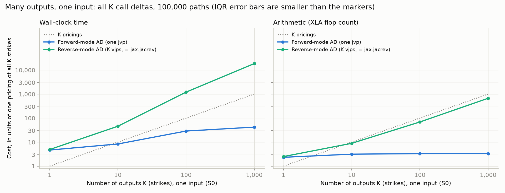
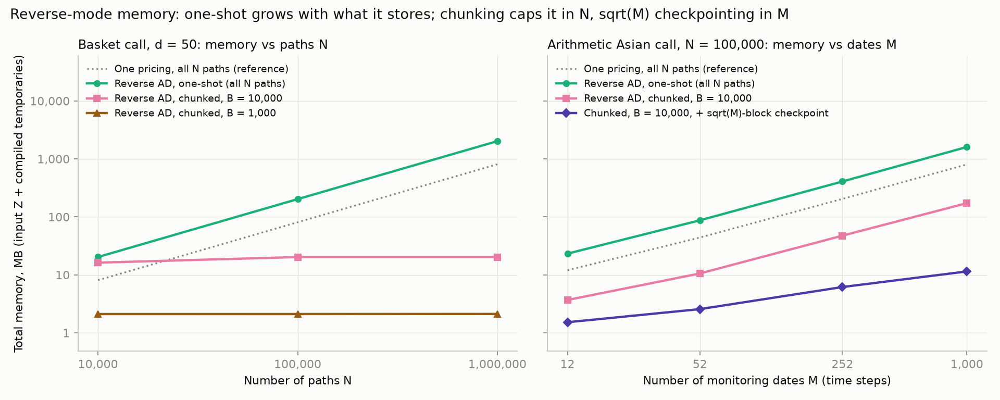

# Experiments: full results

Every experiment in detail: set-up, tables with confidence intervals, figures and
caveats. The [README](../README.md) summarises them; the maths is in
[DERIVATIONS.md](DERIVATIONS.md) and the test policy in [TESTING.md](TESTING.md). How
results moved between versions of the code is recorded in
[CHANGELOG.md](../CHANGELOG.md). Commands are run from the repository root.

Contents: [Timing protocol](#timing-protocol) · [Forward vs reverse mode](#forward-vs-reverse-mode-which-one-should-win) · [E1](#e1-pricer-validation-and-the-cost-of-3-greeks) · [Statistical protocol](#statistical-protocol-for-e2-e5-and-e8) · [E2](#e2-finite-differences-vs-autodiff-delta) · [E3 + E4](#e3--e4-gamma) · [E5](#e5-digital-call-delta) · [E8](#e8-robustness-across-strikes-and-maturities) · [E6](#e6-basket-call-forward-vs-reverse-vs-bumping) · [E9](#e9-are-the-basket-greeks-right-geometric-basket-closed-form) · [E6b](#e6b-the-forward-mode-regime-many-outputs-one-input) · [E7](#memory-and-end-to-end-cost-e7)

## Timing protocol

Every timing is measured after compilation, over repeated runs (at least 3 for the
slow cases, up to 200 for the fast ones), with Python's GC off; the median and
interquartile range (IQR) are reported (`src/mcgreeks/bench.py`). Operation counts
come from XLA's `compile().cost_analysis()`, which works on CPU; it counts a loop
body once regardless of trip count, so counts for chunked programs are read from
the equivalent loop-free program. Hardware for the numbers below: Intel Core
i7-13700HX (`os.cpu_count()` = 24), Windows 11, Python 3.12.10, JAX 0.11.2, CPU backend
(`results/e1_hardware.json`, `results/e6_hardware.json`, `results/e6b_hardware.json`,
`results/e7_hardware.json`, `results/e7_wallclock_hardware.json`).
Timings are hardware-dependent; the flop, transcendental and byte counts are not.
Each figure can be redrawn from its CSV with `--plot-only` (E6, E6b, E7).

## Forward vs reverse mode: which one should win

Cost model (Griewank & Walther 2008; Capriotti 2011, sec. 3; Giles & Glasserman 2006):
for a program with n inputs and m outputs, forward (tangent) mode needs one sweep per
**input**, each ~1-2x one evaluation, while reverse (adjoint) mode needs one sweep per
**output**, ~3-4x one evaluation in total. A price is one scalar output, so **reverse
mode is expected to beat forward mode for any n >= 2 inputs** (close at n = 2, clear
from n = 3). Forward mode wins when outputs outnumber inputs (E6b). The experiments
below confirm both regimes; neither result is a surprise.

## E1: pricer validation and the cost of 3 Greeks

Price + delta, vega, rho of one call, N = 1,000,000 (`results/e1_timing.csv`):

| Method | Median ms [IQR] | x one pricing (time) | x one pricing (flops) | exp/log evaluations |
|---|---|---|---|---|
| Price only | 0.50 [0.47, 0.56] | 1.0 | 1.0 | 1x |
| Forward-mode AD (3 jvps) | 5.03 [4.44, 5.57] | 10.1 | 6.6 | 1x |
| Reverse-mode AD | 4.15 [3.92, 4.84] | 8.4 | 4.3 | 1x |
| Bumping, Python loop (7 pricings) | 4.42 [4.31, 4.56] | 8.9 | 7.0 | 7x |
| Bumping, vmapped (7 pricings) | 5.06 [4.79, 5.52] | 10.2 | 7.0 | 7x |

- **Reverse beats forward with 3 inputs and one output, as the cost model predicts:**
  4.3x vs 6.6x one pricing in flops (~1.9 pricings per forward tangent). None of four
  forward formulations did better: vmapped jvps and `jacfwd` were within noise of
  each other, and 3 separate or scalar jvps were slower.
- The flop ratios are exact and machine-independent. The time ratios are not stable:
  the denominator is a 0.5 ms pricing that moves by 20-25% between runs. A second run
  on the same machine gave price 0.63 ms and reverse 6.7x, forward 8.6x, loop 7.3x,
  vmap 8.4x.
- With only 3 inputs, reverse AD and bumping are within noise in wall-clock. The
  wall-clock ratios sit above the flop ratios because a European pricing is only ~7
  flops per path. It is limited by memory traffic, not arithmetic (see the roofline below).

## Statistical protocol for E2-E5 and E8

Each estimator is evaluated on the same independent batches (E2-E5: 500 batches of
20,000 paths, ATM call, sigma = 0.2, T = 1; E8: 200 batches per cell). Because all
methods share the same random numbers, they are compared with a **paired bootstrap**
(`src/mcgreeks/stats.py`): 2,000 resamples of the batch indices, drawn jointly for all
methods. That gives a 95% percentile CI for each RMSE and for each RMSE ratio.
- **Claims:** "A beats B" is written only if the CI of RMSE(A) / RMSE(B) excludes 1;
  otherwise the two are "not distinguishable".
- **Naive autodiff:** it is identically 0 for gamma and for digital delta, so it is
  reported by its bias, not ranked.
- **Out-of-sample tuning:** the tuned parameters (FD bump h, smoothing width eps) are
  chosen by RMSE on separate calibration batches (`zlib.crc32("e2-e5-calibration")`)
  and evaluated on the evaluation batches, which are unchanged. So the untuned numbers
  did not move.

## E2: finite differences vs autodiff delta

`python experiments/e2_fd_vs_ad.py` (`results/e2_headline.csv`, `results/e2_fd_vs_ad.csv`).

| Delta estimator (h chosen out of sample) | RMSE [95% CI] | RMSE / autodiff [95% CI] | Verdict |
|---|---|---|---|
| Autodiff (pathwise) | 0.00413 [0.00388, 0.00435] | 1 | reference |
| FD, CRN, h = 2.51 | 0.00404 [0.00380, 0.00425] | **0.978 [0.962, 0.994]** | beats autodiff |
| FD, independent seeds, h = 10 | 0.01131 [0.01074, 0.01188] | 2.74 [2.53, 2.97] | worse |

- **Negative result for autodiff: tuned CRN finite differences are 2% more accurate
  than the pathwise (autodiff) delta, and the CI excludes 1.** As h → 0, CRN bumping
  *is* the pathwise estimator (Capriotti 2011, eq. 2.8). At a finite h the central
  difference averages the payoff's kink over ±h, trading an O(h^2) bias for a little
  less variance. The difference is small and needs a tuned h; autodiff needs none.
- Independent seeds are 2.7x worse even at their best h. Common random numbers are
  what make bumping competitive.
- Gamma: the best CRN h is 6.31 (RMSE 0.00029), the best independent-seed h is 15.8
  (0.00125), and naive autodiff returns 0 (RMSE = gamma = 0.01876). Compared in E3.
- Out-of-sample tuning chose the same h as in-sample for all four FD variants: with 500
  batches the RMSE curves are smooth near their minima, so selection bias is
  negligible here.

## E3 + E4: gamma

`python experiments/e3_gamma.py` (`results/e3_gamma.csv`, `e3_pairwise.csv`, `e3_tuning.csv`,
`e4_smoothing.csv`). ATM call, exact gamma 0.01876.

| Estimator | Bias | RMSE [95% CI] | RMSE / best [95% CI] | Verdict |
|---|---|---|---|---|
| Pathwise-LR (parity) | -9.3e-06 | 0.00017 [0.00016, 0.00018] | 1 | best |
| Pathwise-LR (mixed) | 1.4e-05 | 0.00026 [0.00025, 0.00028] | 1.58 [1.45, 1.71] | worse than pathwise-LR (parity) |
| FD, CRN (h = 6.31) | -9.8e-05 | 0.00029 [0.00028, 0.00031] | 1.76 [1.61, 1.92] | worse than pathwise-LR (parity) |
| Autodiff, smoothed (eps = 1.58) | -1.9e-04 | 0.00033 [0.00031, 0.00035] | 1.97 [1.81, 2.15] | worse than pathwise-LR (parity) |
| LR (parity) | -3.0e-05 | 0.00059 [0.00055, 0.00062] | 3.50 [3.26, 3.76] | worse than pathwise-LR (parity) |
| Likelihood ratio | 2.1e-05 | 0.00094 [0.00088, 0.00100] | 5.63 [5.15, 6.16] | worse than pathwise-LR (parity) |
| Autodiff, naive | -0.01876 | 0.01876 | not ranked | identically 0 |

- **Pathwise-LR (parity) is best at the money.** K = 100 is below the forward
  S0 e^{rT} = 105.1, so it uses the put leg. It is 0.63x [0.58, 0.69] the RMSE of plain
  pathwise-LR and 0.57x [0.52, 0.62] that of CRN FD, on the same batches.
- **Among the plain estimators, pathwise-LR beats CRN FD**, narrowly (1.11x
  [1.03, 1.21]). Both beat smoothed autodiff and LR.
- **Smoothed autodiff is worse than CRN FD** (1.12x [1.10, 1.15]), not tied with it.
  Smoothing makes autodiff's gamma usable, but it is not the best fix here.
- **LR (parity)** is 0.62x [0.57, 0.68] the RMSE of LR, but still 2.2x pathwise-LR:
  parity removes the payoff's linear part, not the variance of the LR weight.
- The figure compares the smoothing sweep with the plain estimators. The parity
  estimators are in the table and in `e3_gamma.csv` / `e3_pairwise.csv`.
- E4 (smoothing-width sweep, left panel): bias falls and variance grows as eps shrinks;
  RMSE is minimised at eps ≈ 1.6.

## E5: digital call delta

`python experiments/e5_digital.py` (`results/e5_summary.csv`, `e5_pairwise.csv`, `e5_tuning.csv`,
`e5_digital.csv`). ATM cash-or-nothing call, exact delta 0.01876.

| Estimator | Bias | RMSE [95% CI] | RMSE / best [95% CI] | Verdict |
|---|---|---|---|---|
| Likelihood ratio | 1.2e-05 | 0.00020 [0.00019, 0.00021] | 1 | best |
| FD, CRN (h = 3.98) | -1.1e-04 | 0.00033 [0.00031, 0.00035] | 1.65 [1.52, 1.79] | worse than LR |
| Autodiff, sigmoid (eps = 1.58) | -2.0e-04 | 0.00034 [0.00032, 0.00036] | 1.70 [1.57, 1.84] | worse than LR |
| Autodiff, naive | -0.01876 | 0.01876 | not ranked | identically 0 |

- At the money, **LR beats both FD and smoothed autodiff** (ratios 0.61x and 0.59x).
- **Smoothed autodiff and CRN FD are not distinguishable** (1.03x [0.99, 1.07]).
- The h and eps chosen out of sample equal the in-sample choices.

## E8: robustness across strikes and maturities

`python experiments/e8_sweep.py` (about 1.5 minutes; `results/e8_sweep.csv`, `e8_summary.csv`,
`e8_parity.csv`, `e8_winners.csv`, `e8_lr_vs_T.csv`). Grid K = 80-120 x T = 0.1-2,
sigma = 0.2, S0 = 100. Per cell: 200 evaluation batches of 20,000 paths, with h and eps
tuned on 200 separate calibration batches (17 candidate widths, 0.01-15.8, extended to
63.1 if the choice hits the top). Colour = RMSE / best method in the cell (log scale);
"tie" = the ratio's 95% CI contains 1.

**Parity-switched estimators** (`mcgreeks.greeks_lr`). A call and a put have the same
gamma (C - P = S0 - K e^{-rT} is linear in S0), and the digital call delta is minus the
digital put delta (1{S > K} + 1{S < K} = 1). So "LR (parity)" and "Pathwise-LR (parity)"
apply the same formulas to the put leg when K < S0 e^{rT} (for pathwise-LR,
f'(S) = -1{S < K}), and to the call otherwise. Both legs are unbiased; the put leg drops
the linear part S_T - K, whose true gamma is 0 but whose LR estimate is pure noise.
For K >= forward they are identical to the plain estimators (ratio exactly 1).

Share of the 20 cells in which each method is best or tied with the best:

| Greek | Method | Best or tied: all / ITM (K <= 90) / K >= 100 | Median / worst RMSE vs best |
|---|---|---|---|
| Gamma | **Pathwise-LR (parity)** | **17/20 / 6/8 / 11/12** | 1.00 / 2.9 |
| Gamma | FD, CRN | 8/20 / 3/8 / 5/12 | 1.31 / 3.5 |
| Gamma | Smoothed autodiff | 6/20 / 4/8 / 2/12 | 1.22 / **2.4** |
| Gamma | Pathwise-LR | 6/20 / 0/8 / 6/12 | 1.73 / 28 |
| Gamma | LR (parity) | 0/20 | 2.6 / 6.5 |
| Gamma | LR | 0/20 | 6.4 / 157 |
| Digital delta | **LR (parity)** | **15/20 / 4/8 / 11/12** | 1.00 / **1.7** |
| Digital delta | LR | 11/20 / 0/8 / 11/12 | 1.10 / 23 |
| Digital delta | Smoothed autodiff | 7/20 / 5/8 / 2/12 | 1.18 / 2.0 |
| Digital delta | FD, CRN | 7/20 / 4/8 / 3/12 | 1.29 / 2.0 |

- **Without parity, the at-the-money winners of E3 and E5 do not generalise.** Plain
  pathwise-LR (gamma) and LR (digital delta) are never best in the money, where they
  are up to 28x and 23x worse than the best method (K = 80, T = 0.1).
- **Parity switching largely removes that in-the-money failure.**
  - Pathwise-LR (parity) / pathwise-LR in the 8 ITM cells: 0.045 [0.038, 0.053] at
    K = 80, T = 0.1 up to 0.59 [0.51, 0.68]. The CI excludes 1 in all 8. It is best or
    tied in 6 of 8 ITM cells. Not in K = 80, T = 0.1 (1.29x [1.14, 1.44] the best) or
    K = 90, T = 0.25 (2.93x [2.53, 3.40]).
  - LR (parity) / LR, digital delta: 0.057 [0.049, 0.068] at K = 80, T = 0.1. The gain
    shrinks with T, and it is not significant in 3 of 8 ITM cells (K = 90, T = 1;
    K = 80 and 90, T = 2; e.g. 0.92 [0.81, 1.05]). Worst case over the grid drops from
    23x to 1.68x (K = 90, T = 0.25).
  - LR (parity) gamma cuts LR's worst case from 157x to 6.5x but is still never best:
    parity removes the linear part of the payoff, not the variance of the LR weight.
  - It also helps at K = 100: the strike is below the forward (105.1 at T = 1), so the
    put leg is used. Pathwise-LR (parity) / pathwise-LR = 0.57 [0.50, 0.64] at K = 100,
    T = 1 on these batches, and 0.63 [0.58, 0.69] on E3's 500 batches.
- **The most robust method depends on the Greek.** For digital delta, LR (parity) is
  both the most often best (15/20) and has the smallest worst case (1.7x). For gamma,
  pathwise-LR (parity) is best or tied in 17/20 cells, but smoothed autodiff has the
  smallest worst case (2.4x vs 2.9x).
- **K = 90, T = 0.25 is the one cell where everything but smoothed autodiff does
  badly** (FD 3.55x, pathwise-LR parity 2.93x). A wide smoothing width (eps = 6.3)
  happens to have almost no bias there. FD is at the minimum of its own RMSE curve, so
  this is smoothed autodiff being unusually good, not the others being mistuned.
- **LR gamma never wins**, with or without parity (6.4x and 2.6x the best at the median).
- **LR variance vs T:**
  - At the money, the LR / pathwise-LR RMSE ratio is 3.65 [3.31, 4.01] at T = 0.1 vs
    3.72 [3.39, 4.06] at T = 2: no relative blow-up.
  - LR's absolute error does grow as T → 0 (2.7e-3 vs 7.9e-4), like 1/sqrt(T), but so
    do pathwise-LR's error and the true gamma. The LR weight grows like 1/T, while the
    call payoff it multiplies near the strike shrinks like sqrt(T).
  - The ratio does grow at short maturities in the money: K = 80, 5.5 [4.9, 6.2] at
    T = 0.1 vs 3.6 [3.2, 4.1] at T = 2. It shrinks out of the money: K = 120, 1.6 vs
    3.3.
  - The real failure is short-dated and in the money. At K = 80, T = 0.1 the true gamma
    is tiny, and LR's RMSE is 69x the gamma itself (pathwise-LR's is 12.5x).
- **Selection bias from tuning:** out-of-sample and in-sample widths differ in 9 of 80
  tuned cases, costing 0-4% RMSE.
- **Grid edge:** two FD widths land at the top of the 17-point grid (h = 15.8; gamma
  K = 100, T = 2 and digital delta K = 90, T = 2). The script then extends the grid to
  25.1, 39.8 and 63.1, and calibration still chooses 15.8 in both cells. The optimum is
  interior (RMSE 1.542e-4 and 1.028e-4 on either grid). In those cells FD is best for
  digital delta, and 1.38x pathwise-LR (parity) for gamma.

## E6: basket call, forward vs reverse vs bumping

For d assets there are P = d deltas + d vegas + d(d-1)/2 correlation sensitivities of
one output. `python experiments/e6_basket.py`, N = 100,000 paths, h = 1e-4. Forward
mode and vectorised bumping run in chunks. The budget (16 MB per batched array) is the
fastest of 16 / 64 / 256 MB in `experiments/e6_chunk_sweep.py` (table below).

Cost in units of one pricing, median wall-clock [IQR] and XLA flops:

| d | P | Reverse AD | Forward AD | Bump, loop | Bump, vmap | Flops: rev / fwd / bump |
|---|---|---|---|---|---|---|
| 2 | 5 | 2.9 [2.8, 3.0] | 5.4 [5.2, 5.7] | 11.0 [10.8, 11.2] | 8.3 [8.0, 8.6] | 2.9 / 8.4 / 11 |
| 5 | 20 | 2.8 [2.8, 2.9] | 18 [18, 19] | 44 [42, 46] | 49 [49, 51] | 2.4 / 27 / 41 |
| 10 | 65 | 3.4 [3.1, 3.5] | 55 [54, 55] | 167 [163, 171] | 170 [167, 173] | 2.2 / 79 / 131 |
| 20 | 230 | 3.7 [3.6, 3.7] | 202 [201, 203] | 484 [479, 487] | 764 [759, 771] | 2.1 / 256 / 461 |
| 35 | 665 | 3.8 [3.8, 3.9] | 638 [636, 639] | 1,313 [1,301, 1,313] | 2,236 [2,233, 2,237] | 2.1 / 710 / 1,331 |
| 50 | 1,325 | 4.2 [4.0, 4.3] | 1,359 [1,359, 1,359] | 2,666 [2,662, 2,676] | 4,629 [4,597, 4,637] | 2.05 / 1,389 / 2,650 |

- **Reverse mode is flat; forward mode and bumping grow linearly in P**, reproducing the
  shape of Giles & Glasserman (2006), Fig. 4. Reverse AD costs 2.8-4.2x one pricing in
  time and 2.05-2.9x in flops for any P. Forward AD costs ~1.05-1.7 pricings of
  arithmetic per input, about half of bumping's 2 per input.
- At d = 50: reverse AD 27 ms; forward AD 8.8 s (325x slower); loop bumping 17.3 s
  (637x); vmapped bumping 30.0 s (1,106x).
- All four give the same gradient: forward vs reverse to <= 4.5e-14, vmapped vs loop
  bumping to <= 8.9e-12 (tested in `tests/test_basket.py`). Bumping vs AD differs by
  <= 2.2e-4, the O(h^2) and kink-path error of central differences.
- **AD evaluates every exp once; bumping evaluates it 2P + 1 times.** XLA's
  transcendental count is exactly 1.00x one pricing for both reverse and forward AD
  at every d. Bumping's count is 2P + 1 (2,651x at d = 50). The derivative of exp
  reuses the value already computed on the forward sweep (cf. Giles & Glasserman 2006,
  sec. 7).
- **Reverse-mode flops match the literature; its wall-clock is set by memory traffic.**
  The flop ratio falls to 2.05x at d = 50. That is consistent with Capriotti's (2011,
  Fig. 9b) ~2.3x for basket deltas and vegas, though his figure is a timing of
  hand-coded or tool-generated adjoints and ours is a flop count that also includes the
  correlation sensitivities through the Cholesky factor. The wall-clock ratio is higher
  (4.2x at d = 50) because reverse mode stores the forward sweep's intermediates and
  reads them back. XLA's bytes-accessed count is 3.80x one pricing at every d, and the
  wall-clock ratio tracks it for d >= 10 (3.4-4.2x). At d <= 5 the N x d arrays
  (<= 4 MB) fit in cache and the ratio is lower (2.8-2.9x). E7 measures how much of
  that stored state chunking and checkpointing remove.
- What the benchmark does not claim: the bumps reprice from scratch (generic black-box
  bumping). A hand-written bump could reuse `Z @ L.T` for the delta and vega bumps;
  that is a smarter algorithm, not a fairer benchmark of the same one.

### Vectorised bumping, chunk sizes and the roofline

`python experiments/e6_chunk_sweep.py` (`results/e6_chunk_sweep.csv`,
`results/e6_roofline.csv`). Cost in units of one pricing, median [IQR]:

| d | Loop bumping | vmap, 16 MB | vmap, 64 MB | vmap, 256 MB | Forward, 16 MB | Forward, 256 MB |
|---|---|---|---|---|---|---|
| 20 | 445 | 696 [694, 698] (chunk 1) | 696 [693, 699] (chunk 4) | 954 [953, 954] (chunk 16) | 202 (chunk 1) | 329 (chunk 16) |
| 50 | 2,657 | 4,608 [4,601, 4,611] (chunk 1) | same program as 16 MB | 4,888 [4,880, 4,892] (chunk 6) | 1,378 (chunk 1) | 1,733 (chunk 6) |

Smaller chunks are faster for both chunked methods. Even at its best, **vectorised
bumping is slower than the Python loop for d >= 20** (0.58-0.64x the loop's speed).
It is faster only at d = 2 (1.32x) and roughly equal at d = 5-10 (0.90-0.98x).

Why: on this CPU the pricing is memory-bandwidth-bound. Throughput from XLA's flop
and bytes-accessed counts, divided by median time:

| d | Program | GFLOP/s (% of GEMM peak) | GB/s (% of triad) | flops per byte |
|---|---|---|---|---|
| 20 | one pricing | 31 (7%) | 28 (113%) | 1.1 |
| 20 | loop bumping | 32 (7%) | 29 (117%) | 1.1 |
| 20 | vmap bumping | 21 (5%) | 15 (60%) | 1.4 |
| 20 | reverse AD | 19 (4%) | 31 (124%) | 0.6 |
| 50 | one pricing | 82 (18%) | 31 (125%) | 2.6 |
| 50 | loop bumping | 81 (18%) | 31 (125%) | 2.6 |
| 50 | vmap bumping | 47 (11%) | 14 (58%) | 3.3 |
| 50 | reverse AD | 40 (9%) | 28 (114%) | 1.4 |

The machine reference is a float64 streaming triad `y = 2x + z` at 25 GB/s (the
bandwidth JAX achieves here) and a 4096 x 4096 GEMM at 446 GFLOP/s. The pricing and
the loop run at the streaming bandwidth (above 100% because XLA's byte count is a
model, and some traffic hits cache) and at 7-18% of peak arithmetic.
**Batching the bumps cannot help a bandwidth-bound kernel.** Each bump still has to
stream its own N x d arrays (bytes drop only to 0.8x the loop's). On XLA:CPU the
batched program also reaches only ~60% of the streaming bandwidth: a batched
`Z @ L.T` ran ~1.9x slower than the same number of single GEMMs (99 ms vs 53 ms for
12 at d = 50). This is specific to this backend; on a GPU the balance may differ. In
all cases vectorised bumping does 2P + 1 pricings of work, so its cost grows linearly
in P.

## E9: are the basket Greeks right? (geometric-basket closed form)

E6 shows reverse mode is cheap for the basket, but the arithmetic basket has no closed
form, so its Greeks were only checked indirectly (d = 1 vs Black-Scholes, AD vs CRN
bumping, Euler homogeneity). The **geometric** basket max(prod_i (S_T^i)^{w_i} - K, 0)
has one: log G_T is normal with mean sum_i w_i [log S0_i + (r - sigma_i^2/2) T] and
variance T (w sigma)^T C (w sigma), so the price is Black-Scholes-like and exact deltas,
vegas and correlation sensitivities follow from `jax.grad` of the formula
(`mcgreeks.basket.geometric_basket_price`). The Monte Carlo side is the same code as
the arithmetic basket with only the payoff changed, so this checks the Cholesky
plumbing and all d(d-1)/2 correlation sensitivities.

`python experiments/e9_geometric_basket.py` (about 1 minute; `results/e9_geometric_basket.csv`,
`e9_calibration.csv`, `e9_zscores.csv`). Heterogeneous test baskets
(`example_basket`: S0 80-120, sigma 0.15-0.35, random weights, 2-factor correlation with
both signs), 200,000 paths, SE by batch means over 200 batches, so
z = (MC - exact) / SE ~ t_199.

**Tests** (`tests/test_basket_geometric.py`): all sensitivities at d = 2, 10, 50 as one
family: each within a family-wise threshold (4, 5.06, 5.68 SE), plus mean z and mean z²
over the family (see docs/TESTING.md); closed form = Black-Scholes at d = 1 and at correlation 1 with equal vols (to
1e-12); Monte Carlo at correlation 1 = Black-Scholes within 4 SE (arithmetic and
geometric; the singular correlation matrix gets its Cholesky factor directly, a column
of ones).

| d | Comparisons: sensitivities (+ price) | max \|z\|: price / deltas / vegas / correlations | max \|z\| overall |
|---|---|---|---|
| 2 | 5 (+ price) | 0.52 / 0.52 / 0.68 / 0.39 | 0.68 |
| 10 | 65 (+ price) | 0.58 / 0.60 / 1.77 / 2.61 | 2.61 |
| 50 | 1,325 (+ price) | 0.69 / 0.53 / 1.85 / 2.57 | 2.57 |

**Calibration over 200 independent seeds.** A max |z| of 2.57 over 1,326 comparisons
(1,325 sensitivities + price)
looks too good to be true: independent z's would exceed it almost surely. They are not
independent. The pathwise derivative is e^{-rT} 1{G > K} G d(log G)/d(theta), and
d(log G)/d(S0_i) = w_i / S0_i does not depend on the path, so all d deltas have the
**same** z (1 distinct value at every d), and the other sensitivities share most of their
noise. Repeating the whole experiment on 200 seeds gives independent z's:

| d | mean z^2 [95% CI] (expect 1.010) | share \|z\| > 2 (expect 4.7%) | mean z | P(any \|z\| >= 4): observed [95% CI] / if independent |
|---|---|---|---|---|
| 2 | 0.99 [0.87, 1.13] | 4.6% [3.0, 6.5] | +0.04 [-0.06, +0.14] | 0.0% [0.0, 1.8] / 0.05% |
| 10 | 1.01 [0.94, 1.08] | 4.4% [3.6, 5.3] | +0.02 [-0.04, +0.07] | 0.0% [0.0, 1.8] / 0.6% |
| 50 | 1.03 [1.00, 1.06] | 5.0% [4.6, 5.4] | -0.00 [-0.02, +0.02] | 2.5% [0.8, 5.7] / 11.2% |

Against the closed-form geometric basket, all 1,325 sensitivities (+ price) at d = 50 have
z-scores consistent with t₁₉₉ across 200 independent seeds (mean z² = 1.03 [1.00, 1.06],
mean z = -0.00 [-0.02, +0.02]), confirming no detectable bias and correctly calibrated
standard errors.

- **No bias and calibrated SEs** at every d, for every group (price, deltas, vegas,
  correlations; per-group rows in `e9_calibration.csv`): the Monte Carlo reverse-mode
  Greeks of the basket are right, including all 1,225 correlation sensitivities at d = 50.
- **A plain 4-SE test is not free of false alarms at d = 50:** on a fresh seed it would
  fail about 2.5% of the time [0.8%, 5.7%] with a correct estimator. The independence
  bound (11%) overstates this because the sensitivities are correlated.
  - The test therefore uses family-wise thresholds (Šidák: 5.68 SE at d = 50), plus two
    aggregate checks over the family, mean z and mean z², with SEs that account for
    the correlations.
  - On 200 seeds, both aggregates are ≈ N(0, 1) and there are no individual failures
    (`results/e9_aggregate.csv`, E9 (c)).
  - The false-alarm budget of the whole suite is in [docs/TESTING.md](TESTING.md).

## E6b: the forward-mode regime (many outputs, one input)

`python experiments/e6b_forward_regime.py`: K European calls with strikes over
70..130, one spot, N = 100,000. The K deltas form one Jacobian column: forward mode
gets it from one jvp, and reverse mode needs K pullbacks (what `jax.jacrev` does).
Cost is in units of one pricing of all K strikes; forward and reverse agree to
<= 3.3e-16.

| K | Forward AD, time [IQR] | Reverse AD, time [IQR] | Flops: fwd / rev | Temp memory fwd / rev |
|---|---|---|---|---|
| 1 | 5.1 [5.0, 5.4] | 5.6 [5.2, 5.8] | 2.3 / 2.5 | 3 / 3 MB |
| 10 | 10.5 [9.6, 11.0] | 51 [50, 53] | 3.2 / 8.9 | 25 / 25 MB |
| 100 | 31 [30, 32] | 1,269 [1,257, 1,269] | 3.3 / 69 | 241 / 241 MB |
| 1,000 | 43 [43, 44] | 17,261 [16,566, 17,818] | 3.3 / 669 | 2.4 / 2.4 GB |

- **The mirror image of E6:** forward-mode flops are flat (2.3-3.3x), and reverse-mode
  flops grow linearly in K (~0.67 K). At K = 1,000, forward mode takes 0.23 s and
  reverse mode 92 s. With 1 output and 1 input (K = 1) the two are equal within noise.
- **Negative result: forward mode is flat in flops but not in wall-clock** (5x to 43x).
  The K-strike price fuses into one pass and never stores the N x K payoff matrix
  (temp memory ~0). The jvp materialises N x K intermediates (2.4 GB at K = 1,000;
  XLA bytes accessed 4.8 GB vs 0.8 MB for the price). Its time is again set by memory
  traffic, not arithmetic.
- Reverse mode's time grows faster than its flops (1,269x time vs 69x flops at
  K = 100). Each chunked pullback re-reads the stored N x K residuals.

## Memory and end-to-end cost (E7)

`python experiments/e7_memory.py` (memory and flops, compile-only, deterministic) and
`python experiments/e7_wallclock.py` (end-to-end pipelines, timed).
**Flops are the primary cost metric in this section; wall-clock is secondary.**

A one-shot `jax.grad` of the mean over all N paths stores every path's intermediates.
The **chunked adjoint** (`src/mcgreeks/chunked.py`) differentiates B paths at a time
and sums the batch gradients inside one `lax.scan`. It relies on the gradient of a mean
being the mean of the batch gradients, as in the path-by-path adjoint of Giles &
Glasserman (2006).
- **In-batch random numbers:** each batch draws its own normals from
  `jax.random.fold_in(key, b)`, so nothing N-sized exists.
- **Hoisted parameter work:** work that depends only on the parameters (the basket's
  Cholesky factor) runs once, and one `vjp` maps its gradient back to rho.
- **Validation:** on the same `fold_in` stream, every chunked gradient matches the
  one-shot gradient to <= 5.9e-12 relative. Tests cover the European call, the basket
  at d = 5 and the Asian, with and without checkpointing.

### Memory

Total MB = input normals (one-shot only) + compiled temporaries (`memory_analysis()`).
Flops are XLA's count on the lowered HLO, with loop bodies multiplied by their trip
counts. They are shown **excluding random-number generation**, in units of the
one-shot pricing, to isolate the adjoint. End-to-end costs including the RNG follow below.

Basket call, d = 50:

| N | Flops x (excl. RNG): one-shot / chunked, hoisted / B = 1,000, Cholesky per batch | Total MB: one-shot / chunked B = 10,000 / B = 1,000 |
|---|---|---|
| 10,000 | 1.92 / 2.05 / 3.26 | 20.3 / 16.2 / 2.1 |
| 100,000 | 2.03 / 2.05 / 3.56 | 202 / 20.3 / 2.1 |
| 1,000,000 | 2.05 / 2.05 / 3.60 | 2,024 / 20.3 / 2.1 |

Arithmetic Asian call, N = 100,000, B = 10,000; sqrt(M) time blocks of 3, 4, 14, 25 steps:

| M | Flops x (excl. RNG): one-shot / chunked / + sqrt(M) checkpoint | Total MB: one-shot / chunked / + sqrt(M) checkpoint |
|---|---|---|
| 12 | 2.29 / 2.27 / 3.00 | 23.2 / 3.7 / 1.5 |
| 52 | 2.26 / 2.25 / 3.00 | 87.2 / 10.6 / 2.6 |
| 252 | 2.25 / 2.25 / 3.00 | 407 / 47.4 / 6.2 |
| 1,000 | 2.25 / 2.25 / 3.00 | 1,604 / 172 / 11.4 |

- **Chunking caps memory in N, as the adjoint literature describes.**
  - One-shot memory grows with what it stores: N for the basket (about 2 KB per path at
    d = 50, including the normals), and N x M for the Asian.
  - Chunked memory is 2.1 MB (B = 1,000) or 20 MB (B = 10,000) in total, whatever N is.
  - Hoisting the Cholesky factorisation brings chunked flops to 2.05x, identical to
    one-shot. Recomputing it per batch cost 3.26-3.60x at B = 1,000.
- **sqrt(M) checkpointing caps it in M.** Each block of ~sqrt(M) time steps (including
  drawing its normals) is wrapped in `jax.checkpoint`, so only block-boundary carries are
  stored and one block is recomputed at a time (Griewank & Walther 2008, ch. 12).
  - Memory: 172 → 11.4 MB at M = 1,000, and growing like sqrt(M) (total MB / sqrt(M) =
    0.44, 0.36, 0.39, 0.36 for M = 12 to 1,000).
  - Cost: about 2x the flops (2.03x the chunked pricing, 1.96x the chunked gradient),
    because the forward sweep and every normal are computed twice.
  - Checkpointing each *single* step saves nothing (measured with the normals
    precomputed: 960 MB at M = 1,000 with or without it): a GBM step's residual is one
    array, the same
    size as the carry it stores instead.

### End-to-end cost: random numbers + pricing + gradient

Every pipeline starts from a key and does all of its own work. One-shot draws all N
normals in one call; chunked draws them per batch. At least 10 timed runs per basket
program and 30 per Asian program; every IQR is <= 18% of its median
(`results/e7_wallclock.csv`, `results/e7_wallclock_views.csv`).

AD overhead = gradient / pricing of the **same** pipeline (N = 1e6 basket, N = 1e5 Asian):

| Pipeline | Flops x | Time x | RNG share of pricing: flops / time |
|---|---|---|---|
| Basket, one-shot | 1.45 | 1.47 | 58% / 96% |
| Basket, chunked B = 10,000 | 1.45 | 1.74 | 58% / 100% |
| Basket, chunked B = 100,000 | 1.45 | 1.44 | 58% / 92% |
| Asian, one-shot, M = 12 / 52 / 252 / 1,000 | 1.03-1.04 | 1.77 / 1.59 / 1.50 / 1.58 | 98% / 87-105% |
| Asian, chunked, M = 12 / 52 / 252 / 1,000 | 1.03-1.04 | 1.78 / 1.40 / 1.01 / 0.85* | 98% / 44-80% |
| Asian, chunked + sqrt(M) checkpoint | 2.03 | 2.23-2.42 | 98% / 44-80% |

\* A ratio below 1 is not a real negative overhead; see the caveats.

Chunk-size trade-off, basket, N = 1e6 (same work as one-shot: flops ratio 1.00):

| B | Total MB | Memory vs one-shot (1,632 MB) | End-to-end time vs one-shot (557 ms) |
|---|---|---|---|
| 1,000 | 2.1 | 770x less | 2.95x |
| 10,000 | 20.3 | 80x less | 1.03x |
| 100,000 | 202 | 8x less | 0.85x |

- **Random-number generation dominates the price.** It is 58% of basket pricing flops
  and 98% of Asian pricing flops. In time it is 87-105% of one-shot pricing (the one row
  above 100%, Asian M = 12, is a small-program timing artefact) and 44-100% of chunked
  pricing. The "x one pricing" ratios elsewhere in this document (E1, E6, and the memory
  tables above) exclude the RNG, because there the normals are an input.
- **End-to-end, AD costs ~1.5x one pricing** (basket 1.47x, Asian 1.5-1.8x) in time,
  and 1.03-1.45x in flops. That is below Capriotti's (2011) ~2.3x, and the reason is
  not a better adjoint. The random numbers are part of the price but are never
  differentiated, so they add to the denominator only. Excluding them (tables above),
  the adjoint's arithmetic is 2.05-2.25x, in line with Capriotti.
- **Chunk size: recommend B = 1e4-1e5.** At N = 1e6, B = 1e4 uses 80x less memory for
  1.03x the time, and B = 1e5 uses 8x less memory and is 15% *faster* (0.85x). B = 1e3
  saves the most memory but is 2.95x slower.
- **Why small B is slow: lost multi-core parallelism, not extra work.** The flops are
  identical at every B. Pinned to a single core (basket, N = 1e5,
  `results/e7_bsweep_onecore.csv`), chunking costs nothing: B = 1e4 is faster than
  one-shot (151 vs 186 ms) and B = 1e5 equal (186 ms). B = 1e3 is 21% slower, from loop
  overhead. On all 24 threads, one-shot and B = 1e5 run 3.6-3.7x faster than on one core,
  B = 1e4 2.9x, but B = 1e3 only 1.3x: its small per-batch arrays cannot keep the cores
  busy.
- **Did chunking close the wall-clock gap?** In the end-to-end view (a), yes for the
  basket at B = 1e4-1e5 (1.03x and 0.85x one-shot's time, same flops). For the Asian,
  no: chunked is 1.7x (M = 1,000) to 10x (M = 12) slower than one-shot end-to-end. This
  is because its per-block random-number generation parallelises poorly (next bullet),
  not because of the adjoint.

Caveats:
- **AD-overhead ratios below 1** (basket chunked B = 1e3: 0.70; Asian chunked M = 1,000:
  0.85) come from how XLA compiles the price-only program. That program is slower than
  the gradient program that contains it. They are artefacts, not negative costs;
  for those rows use the flops ratio (1.45x, 1.03x). The cause was not investigated further.
- **Wall-clock is bimodal between runs.** For example, the M = 1,000 checkpointed
  gradient took 2.5 s, 3.8 s and 5.2 s in separate runs, each with a tight IQR (5% in
  the 5.2 s run). The i7-13700HX mixes performance and efficiency cores, and which cores
  the OS schedules a run on is the likely cause (not verified). Flops are unaffected.
- **Chunked Asian random numbers parallelise poorly at small B x M.** Each time block
  draws only m x B normals (3 x 10,000 at M = 12), too little work to spread over the
  cores. Chunked RNG alone takes 49 ms vs 6.6 ms one-shot at M = 12, and 1.7 s vs 0.63 s
  at M = 1,000.
- **Memory footprint does not explain reverse mode's wall-clock gap** (time 4-6x vs
  flops 2x). Chunking to a 2-20 MB footprint with the normals precomputed did not
  remove it: flops stayed 2.03-2.25x while time stayed 3.8-10.5x. That hypothesis is
  rejected. The measurement came from a pricing-only timing script whose CSV was not
  kept (see CHANGELOG.md); the end-to-end view above is the fair comparison.
